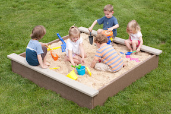

# rstats4bio_sandbox
A shared sandbox to play around with code and data.
This is a spot to push code that can be open and viewed by others. 

**Instructions**  
1. Clone repo.  
2. Select a nickname for yourself for your work.  I call 'finn'.  
3. Push small data files or rmarkdown docs with your work and explorations here.  
4. Please name your rmarkdown files using the following structure: finn_surveydata_EDA.rmd  
5. If you push data to repo, please always put in the 'data' folder.  

